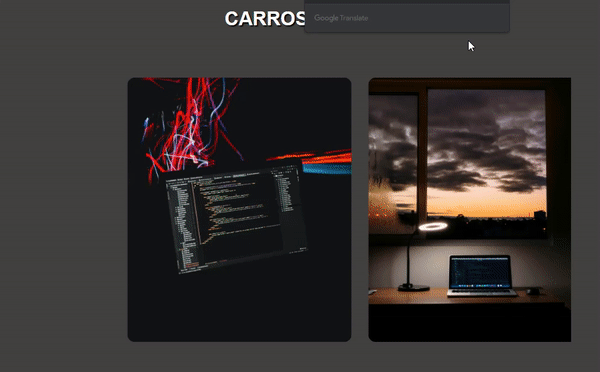
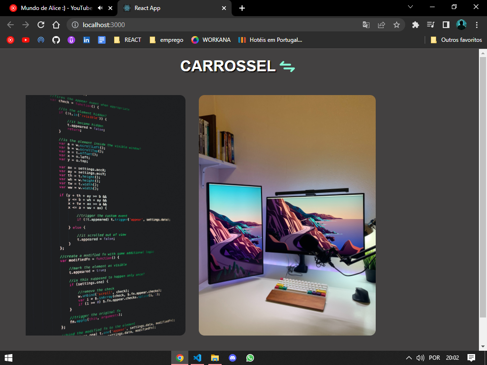
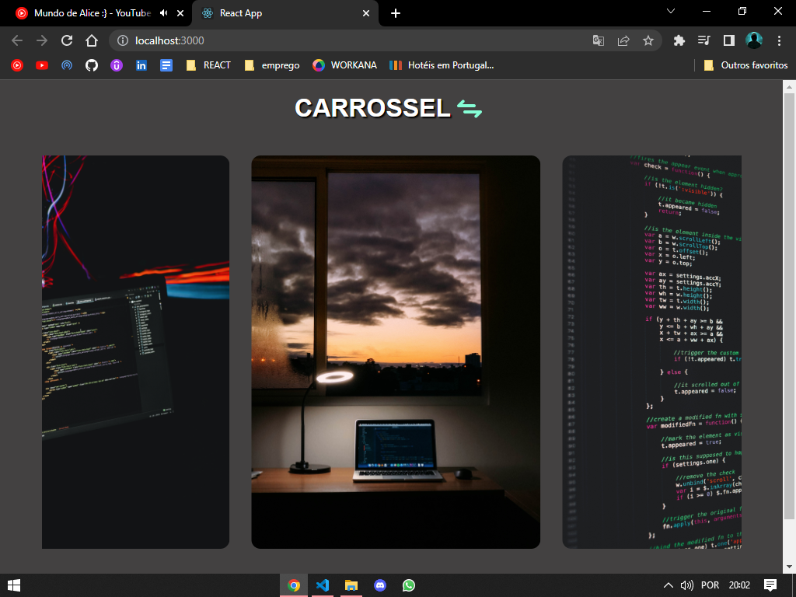

# CARROSSEL🎡

  Projeto de um slider, ou em em português carrossel de imagens.
  Apenas para fins de aprendizado e treinamento

## DEMONSTRAÇÃO™

## TECNOLOGIAS UTILIZADAS👨🏻‍💻
HTML/CSS, JS, ReactJS (React-icons and framer-motion).

 ## ADICIONAIS💋

